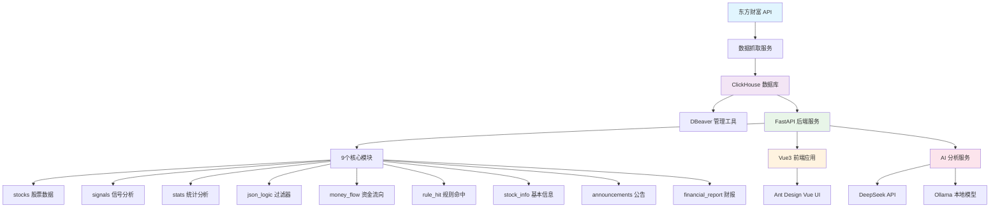

# 📈 Stock Analysis ClickHouse | 股票分析系统

[](https://github.com/jinpeng-vnode/stock-analysis-clickhouse/stargazers)
[](https://github.com/jinpeng-vnode/stock-analysis-clickhouse/network)
[](https://opensource.org/licenses/MIT)
[](https://www.python.org/downloads/)
[](https://vuejs.org/)

> 基于 ClickHouse 的高性能股票数据分析系统 | High-performance stock data analysis system based on ClickHouse

## 功能全景图 — 完成度: 100%

> 项目定义：基于 ClickHouse 的高性能沪深 A 股数据采集、技术分析、AI 智能研判一体化系统
> 当前阶段：已上线（Docker 一键部署）
> 下一步优先级：（待老板指定）
> 禁止：（待老板指定）

```
stock-analysis-clickhouse
├── 后端 API 服务（api_server.py + stock/）
│   ├── stocks 股票数据模块
│   │   ├── 股票列表查询 — ✅
│   │   ├── 日K线数据查询 — ✅
│   │   └── 批量数据获取 — ✅
│   ├── stock_signal 信号分析模块
│   │   ├── WR 威廉指标分析 — ✅
│   │   ├── MA 移动平均线分析 — ✅
│   │   └── 买卖信号生成 — ✅
│   ├── stock_stats 统计分析模块
│   │   ├── 市场概览统计 — ✅
│   │   └── 涨跌排行 — ✅
│   ├── stock_json_logic_filter 规则过滤模块
│   │   ├── JsonLogic 数据过滤 — ✅
│   │   └── 复杂条件组合查询 — ✅
│   ├── stock_money_flow 资金流向模块
│   │   ├── 个股资金流向 — ✅
│   │   ├── 板块资金流向 — ✅
│   │   └── 资金流向汇总 — ✅
│   ├── stock_rule_hit 规则命中模块
│   │   ├── 规则列表管理 — ✅
│   │   └── 规则命中检测 — ✅
│   ├── stock_info 基本信息模块
│   │   ├── 公司基本信息 — ✅
│   │   ├── PE 估值查询 — ✅
│   │   └── 行业分类 — ✅
│   ├── stock_announcement 公告模块
│   │   ├── 公司公告查询 — ✅
│   │   └── 公告搜索 — ✅
│   └── stock_financial_report 财报模块
│       ├── 利润表 — ✅
│       ├── 资产负债表 — ✅
│       └── 现金流量表 — ✅
├── AI 智能分析（stock_ai/）
│   ├── DeepSeek 函数调用分析（stock_ai_analysis.py） — ✅
│   ├── Ollama 本地模型对话（ollama_chat.py） — ✅
│   └── 多维度数据读取器（readers/）
│       ├── K线数据读取 — ✅
│       ├── 资金流向读取 — ✅
│       ├── 新闻读取 — ✅
│       ├── 公告读取 — ✅
│       ├── 公司信息读取 — ✅
│       ├── 财报读取 — ✅
│       ├── 板块读取 — ✅
│       ├── 股票信息读取 — ✅
│       └── 股票搜索 — ✅
├── 数据采集脚本（scripts/）
│   ├── 股票代码导入（import_stock_codes.py） — ✅
│   ├── 历史日K线抓取（fetch_daily_data.py） — ✅
│   ├── 今日数据更新（update_today_data.py） — ✅
│   ├── 资金流向更新（update_money_flow_data.py） — ✅
│   ├── 技术指标计算（compute_indicators.py） — ✅
│   ├── 公告抓取-按股票（announcement_fetch/producer_by_stock.py） — ✅
│   ├── 公告抓取-按日期（announcement_fetch/producer_by_date.py） — ✅
│   ├── 公告消费者（announcement_fetch/consumer.py） — ✅
│   ├── 公司信息抓取（stock_company_info_fetch/） — ✅
│   ├── 财报抓取（financial_report_fetch/） — ✅
│   ├── 数据合并（merge_data.py） — ✅
│   ├── CSV导入（import_csv_daily.py） — ✅
│   ├── 规则命中种子（seed_rule_hits.py） — ✅
│   ├── 数据库迁移（migrate.py） — ✅
│   └── 清理非活跃分区（cleanup_inactive_parts.py） — ✅
├── 公共模块（common/）
│   ├── ClickHouse 客户端连接池（db/clickhouse_client.py） — ✅
│   ├── 自动迁移工具（db/migrate.py） — ✅
│   └── 技术指标工具（utils/）
│       ├── Williams %R 计算 — ✅
│       ├── MACD 计算 — ✅
│       ├── 趋势分析 — ✅
│       ├── 信号统计 — ✅
│       └── 代理池 — ✅
├── 前端应用（kline-vue/）
│   ├── 页面路由（16 个页面）
│   │   ├── K线分析页 — ✅
│   │   ├── 候选管理页 — ✅
│   │   ├── 股票信息管理页 — ✅
│   │   ├── 信号分析页 — ✅
│   │   ├── 系统状态页 — ✅
│   │   ├── 回测配置页 — ✅
│   │   ├── 回测结果页 — ✅
│   │   ├── 资金流向页 — ✅
│   │   ├── 规则命中页 — ✅
│   │   ├── 股票公告页 — ✅
│   │   ├── 财报表页 — ✅
│   │   ├── 知识图谱页 — ✅
│   │   ├── DeepSeek API 包装器页 — ✅
│   │   ├── DeepSeek 股票分析页 — ✅
│   │   ├── 多阶段Agent调试页 — ✅
│   │   └── 日K/分钟K图表页 — ✅
│   ├── 核心组件（components/）
│   │   ├── KLineChart K线图表 — ✅
│   │   ├── SignalAnalysis 信号分析 — ✅
│   │   ├── JsonLogicSignalAnalysis 规则信号 — ✅
│   │   ├── JsonLogicRuleEditor 规则编辑器 — ✅
│   │   ├── StockRuleEditor 股票规则编辑 — ✅
│   │   ├── SimTrading 模拟交易 — ✅
│   │   ├── AutoTrading 自动交易 — ✅
│   │   ├── StockSelector 股票选择器 — ✅
│   │   ├── KnowledgeGraph 知识图谱 — ✅
│   │   └── AnalysisComparison 分析对比 — ✅
│   ├── 回测引擎（backtest/core/）
│   │   ├── BacktestEngine 回测核心 — ✅
│   │   ├── PositionManager 仓位管理 — ✅
│   │   └── TradingCost 交易成本 — ✅
│   ├── 知识图谱渲染（knowledge-graph/）
│   │   ├── 图谱渲染器 — ✅
│   │   └── 自定义节点系统 — ✅
│   ├── AI 客户端工具（utils/）
│   │   ├── DeepSeek API 客户端 — ✅
│   │   ├── DeepSeek API 包装器 — ✅
│   │   ├── Ollama 客户端 — ✅
│   │   ├── 多阶段Agent — ✅
│   │   └── AI 统一客户端 — ✅
│   └── 状态管理（stores/）
│       ├── 全局配置 — ✅
│       └── 候选列表 — ✅
├── 数据库（ClickHouse）
│   ├── 核心表结构（sql/01_create_tables.sql） — ✅
│   ├── 视图（sql/02_create_views.sql） — ✅
│   ├── 资金流向表（sql/03_create_money_flow_tables.sql） — ✅
│   ├── 规则命中表（sql/04_create_rule_stock_hit.sql） — ✅
│   ├── 公告表（sql/05_create_announcement_tables.sql） — ✅
│   └── 财报表（sql/06_create_financial_report_tables.sql） — ✅
└── 基础设施（Docker）
    ├── docker-compose 服务编排（10 服务） — ✅
    ├── ClickHouse 数据库服务 — ✅
    ├── FastAPI 后端服务 — ✅
    ├── Vue3 前端服务 — ✅
    ├── 数据抓取服务 — ✅
    ├── 今日数据更新服务 — ✅
    ├── 资金流向更新服务 — ✅
    ├── 公告生产者×2 + 消费者 — ✅
    └── DBeaver 数据库管理工具 — ✅
```

## ✨ 项目亮点

### 🚀 极致性能
采用 ClickHouse 列式数据库，相比传统 TimescaleDB 具有显著性能优势：

| 指标 | TimescaleDB | ClickHouse | 提升倍数 |
|------|-------------|------------|----------|
| 批量写入 | 1,000 条/秒 | 50,000 条/秒 | **50x** |
| 4,375 万条写入 | 728 分钟 | 14 分钟 | **52x** |
| 查询 2024 年信号 | 扫描所有数据 | 扫描 1 个分区 | **30x+** |
| 查询最近 30 天 | 18 秒 | 0.5 秒 | **36x** |
| 存储空间 | 8-10 GB | 500 MB | **16-20x** |

### 🎯 核心特性
- **实时数据采集**: 东方财富 API 自动抓取股票数据
- **高性能存储**: ClickHouse 列式数据库优化查询性能  
- **智能分析**: WR/MA 技术指标、信号分析、资金流向分析
- **可视化界面**: Vue3 + Ant Design Vue 现代化 UI
- **AI 集成**: 支持 DeepSeek/Ollama 智能分析

## 🏗️ 系统架构



## 📋 功能列表

### 📊 数据管理
- **股票代码管理**: 沪深 A 股完整股票列表
- **日K线数据**: 历史价格、成交量、成交额
- **实时更新**: 自动抓取最新交易数据
- **数据清洗**: 异常值检测和处理

### 📈 技术分析
- **WR 指标**: 威廉指标超买超卖分析
- **MA 指标**: 移动平均线多空趋势
- **信号生成**: 买入/卖出信号自动识别
- **规则引擎**: 自定义技术指标组合

### 💰 资金分析
- **资金流向**: 主力资金净流入/流出统计
- **大单追踪**: 大单交易实时监控
- **机构持仓**: 机构投资者持仓变化
- **热钱分析**: 热点板块资金轮动

### 📰 信息聚合
- **公司公告**: 重大事项公告实时推送
- **财务报表**: 财务数据深度分析
- **新闻资讯**: 相关新闻情感分析
- **基本面**: 公司基本信息和估值

### 🤖 AI 智能分析
- **DeepSeek 集成**: GPT 级别智能分析
- **Ollama 支持**: 本地私有化部署
- **自然语言查询**: 用自然语言查询股票数据
- **智能推荐**: AI 驱动的投资建议

## 🚀 快速开始

### 方式一：Docker 一键启动（推荐）

```bash
# 克隆项目
git clone https://github.com/jinpeng-vnode/stock-analysis-clickhouse.git
cd stock-analysis-clickhouse

# 启动所有服务
docker-compose up -d

# 访问应用
# 前端: http://localhost:3000
# API文档: http://localhost:8000/docs  
# 数据库管理: http://localhost:8978
```

Docker 包含以下服务：
- **ClickHouse**: 高性能数据库
- **FastAPI**: 后端 API 服务
- **Vue3 前端**: 现代化界面
- **DBeaver**: 数据库管理工具

### 方式二：手动部署

#### 后端部署
```bash
# Python 3.11+ 环境
python -m venv venv
source venv/bin/activate  # Windows: venv\Scripts\activate

# 安装依赖
pip install -r requirements.txt

# 配置环境变量
cp env.example .env
# 编辑 .env 文件配置数据库连接等

# 启动后端服务
python api_server.py
```

#### 前端部署
```bash
cd kline-vue

# 安装依赖
yarn install

# 开发模式
yarn dev

# 生产构建
yarn build
```

#### ClickHouse 安装配置
```bash
# Ubuntu/Debian
sudo apt-get install clickhouse-server clickhouse-client

# CentOS/RHEL  
sudo yum install clickhouse-server clickhouse-client

# 启动服务
sudo systemctl start clickhouse-server
sudo systemctl enable clickhouse-server

# 创建数据库
clickhouse-client
CREATE DATABASE stock_analysis;
```

## 📦 数据初始化

### 1. 导入股票代码
```bash
# 运行股票代码导入脚本
python scripts/import_stock_codes.py
```

### 2. 抓取历史数据
```bash
# 抓取所有股票的日K线数据
python scripts/fetch_historical_data.py --start-date 2020-01-01

# 抓取特定股票数据
python scripts/fetch_historical_data.py --stock 000001 --start-date 2023-01-01
```

### 3. 计算技术指标
```bash
# 计算 WR 和 MA 指标
python scripts/calculate_indicators.py --indicators WR,MA

# 计算自定义指标
python scripts/calculate_indicators.py --custom-config indicators_config.json
```

### 4. 数据验证
```bash
# 验证数据完整性
python scripts/validate_data.py

# 生成数据质量报告
python scripts/data_quality_report.py
```

## ⚙️ 配置说明

### 环境变量配置

参考 `env.example` 文件配置以下参数：

```bash
# ClickHouse 数据库配置
CLICKHOUSE_HOST=localhost        # 数据库主机
CLICKHOUSE_PORT=9000            # 数据库端口  
CLICKHOUSE_DB=stock_analysis    # 数据库名
CLICKHOUSE_USER=default         # 用户名
CLICKHOUSE_PASSWORD=            # 密码

# API 服务配置
API_HOST=0.0.0.0                # API 服务主机
API_PORT=8000                   # API 服务端口
DEBUG=False                     # 调试模式

# 日志配置
LOG_LEVEL=INFO                  # 日志级别
LOG_FILE=logs/app.log           # 日志文件路径

# 数据抓取配置
MAX_WORKERS=10                  # 最大并发数
BATCH_SIZE=10000                # 批处理大小
FETCH_INTERVAL=3600             # 抓取间隔(秒)

# 技术指标配置
WR_PERIODS=[6, 10]              # WR 指标周期
MA_PERIODS=[5, 10, 20]          # MA 指标周期

# AI 分析配置
DEEPSEEK_API_KEY=               # DeepSeek API Key
DEEPSEEK_BASE_URL=https://api.deepseek.com/v1
DEEPSEEK_MODEL=deepseek-chat
```

## 📚 API 文档

系统提供 9 个核心 API 模块，共 50+ 接口：

### 📊 stocks - 股票数据
```
GET  /api/stocks/list           # 获取股票列表
GET  /api/stocks/{stock_code}   # 获取股票详情
GET  /api/stocks/{stock_code}/kline  # 获取K线数据
POST /api/stocks/batch          # 批量获取股票数据
```

### 🎯 signals - 信号分析  
```
GET  /api/signals/wr/{stock_code}     # WR指标分析
GET  /api/signals/ma/{stock_code}     # MA指标分析
GET  /api/signals/buy/{stock_code}    # 买入信号
GET  /api/signals/sell/{stock_code}   # 卖出信号
POST /api/signals/custom              # 自定义信号
```

### 📈 stats - 统计分析
```
GET  /api/stats/overview              # 市场概览
GET  /api/stats/sector/{sector}       # 板块统计
GET  /api/stats/ranking               # 涨跌排行
GET  /api/stats/volume                # 成交量统计
```

### 🔍 json_logic - 过滤器
```
POST /api/json_logic/filter           # 数据过滤
POST /api/json_logic/query            # 复杂查询
GET  /api/json_logic/schemas          # 过滤器模式
```

### 💰 money_flow - 资金流向
```
GET  /api/money_flow/{stock_code}     # 个股资金流向
GET  /api/money_flow/sector/{sector}  # 板块资金流向
GET  /api/money_flow/summary          # 资金流向汇总
```

### 🎯 rule_hit - 规则命中
```
GET  /api/rule_hit/list               # 规则列表
POST /api/rule_hit/check              # 检查规则命中
GET  /api/rule_hit/history/{rule_id} # 命中历史
```

### 📋 stock_info - 基本信息
```
GET  /api/stock_info/{stock_code}     # 公司基本信息
GET  /api/stock_info/{stock_code}/pe  # PE估值
GET  /api/stock_info/sectors          # 行业分类
```

### 📰 announcements - 公告
```
GET  /api/announcements/{stock_code}  # 公司公告
GET  /api/announcements/latest        # 最新公告
GET  /api/announcements/search       # 公告搜索
```

### 📊 financial_report - 财报
```
GET  /api/financial_report/{stock_code}  # 财务报表
GET  /api/financial_report/{stock_code}/income    # 利润表
GET  /api/financial_report/{stock_code}/balance  # 资产负债表
```

> 完整 API 文档访问: http://localhost:8000/docs

## 🛠️ 技术栈

### 后端技术
- **Python 3.11+**: 现代 Python 语法特性
- **FastAPI**: 高性能异步 Web 框架
- **ClickHouse**: 列式数据库，极致查询性能
- **Pydantic**: 数据验证和序列化
- **Loguru**: 结构化日志记录
- **Uvicorn**: ASGI 服务器

### 前端技术
- **Vue 3**: 渐进式 JavaScript 框架
- **TypeScript**: 类型安全的 JavaScript
- **Ant Design Vue**: 企业级 UI 组件库
- **Pinia**: Vue 状态管理
- **Vite**: 现代化构建工具
- **ECharts**: 数据可视化图表库

### 基础设施
- **Docker**: 容器化部署
- **Docker Compose**: 多服务编排
- **Nginx**: 反向代理和静态文件服务
- **DBeaver**: 数据库管理工具

### AI 集成
- **DeepSeek**: 大语言模型 API
- **Ollama**: 本地大模型部署
- **JSON Logic**: 规则引擎

## 📁 项目结构

```
stock-analysis-clickhouse/
├── 📄 README.md                   # 项目说明文档
├── 📄 LICENSE                     # MIT 开源协议
├── 📄 CONTRIBUTING.md             # 贡献指南
├── 📄 .gitignore                  # Git 忽略文件
├── 📄 env.example                 # 环境变量模板
├── 📄 requirements.txt            # Python 依赖
├── 📄 api_server.py              # FastAPI 主入口
├── 📄 config.py                  # 配置管理
├── 📄 clickhouse-config.xml      # ClickHouse 配置
├── 🐳 Dockerfile                 # 后端 Docker 镜像
├── 🐳 docker-compose.yml         # 服务编排
├── 📁 common/                    # 公共模块
│   ├── 📁 db/                    # 数据库连接
│   ├── 📁 utils/                 # 工具函数
│   └── 📁 schemas/               # 数据模式
├── 📁 stock/                     # 业务模块
│   ├── 📁 stocks/                 # 股票数据
│   ├── 📁 stock_signal/          # 信号分析
│   ├── 📁 stock_stats/           # 统计分析
│   ├── 📁 stock_json_logic/      # 过滤器
│   ├── 📁 stock_money_flow/      # 资金流向
│   ├── 📁 stock_rule_hit/        # 规则命中
│   ├── 📁 stock_info/            # 基本信息
│   ├── 📁 stock_announcement/    # 公告
│   └── 📁 stock_financial_report/ # 财报
├── 📁 stock_ai/                  # AI 分析模块
├── 📁 scripts/                   # 数据脚本
├── 📁 sql/                       # SQL 脚本
├── 📁 kline-vue/                 # 前端应用
│   ├── 📄 package.json           # 前端依赖
│   ├── 📄 vite.config.ts        # Vite 配置
│   ├── 📁 src/                   # 源代码
│   │   ├── 📁 components/       # 组件
│   │   ├── 📁 views/            # 页面
│   │   ├── 📁 stores/           # 状态管理
│   │   └── 📁 utils/            # 工具函数
│   └── 🐳 Dockerfile             # 前端 Docker 镜像
└── 📁 logs/                      # 日志文件
```

## 🤝 参与贡献

我们欢迎所有形式的贡献！请查看 [CONTRIBUTING.md](CONTRIBUTING.md) 了解详细信息。

### 快速参与
1. **Fork** 项目到您的 GitHub
2. **Clone** 到本地进行开发
3. **创建** 功能分支: `git checkout -b feature/amazing-feature`
4. **提交** 您的更改: `git commit -m 'feat: 添加某个神奇功能'`
5. **推送** 到分支: `git push origin feature/amazing-feature`
6. **创建** Pull Request

## 📄 许可证

本项目采用 [MIT License](LICENSE) 开源协议。

## 👨‍💻 作者

**jinpeng-vnode** — [GitHub](https://github.com/jinpeng-vnode)

如果这个项目对你有帮助，请给个 ⭐ Star！

---

## 🙏 致谢

感谢以下开源项目的支持：
- [ClickHouse](https://github.com/ClickHouse/ClickHouse) - 高性能列式数据库
- [FastAPI](https://github.com/tiangolo/fastapi) - 现代化 Python Web 框架  
- [Vue.js](https://github.com/vuejs/vue) - 渐进式 JavaScript 框架
- [Ant Design Vue](https://github.com/vueComponent/ant-design-vue) - 企业级 UI 组件库

## 📞 联系我们

- 🐛 **Bug 报告**: [GitHub Issues](https://github.com/jinpeng-vnode/stock-analysis-clickhouse/issues)
- 💡 **功能建议**: [GitHub Discussions](https://github.com/jinpeng-vnode/stock-analysis-clickhouse/discussions)
- 📧 **商务合作**: 通过 GitHub Issues 联系

---

⚡ **开始您的股票数据分析之旅！**
